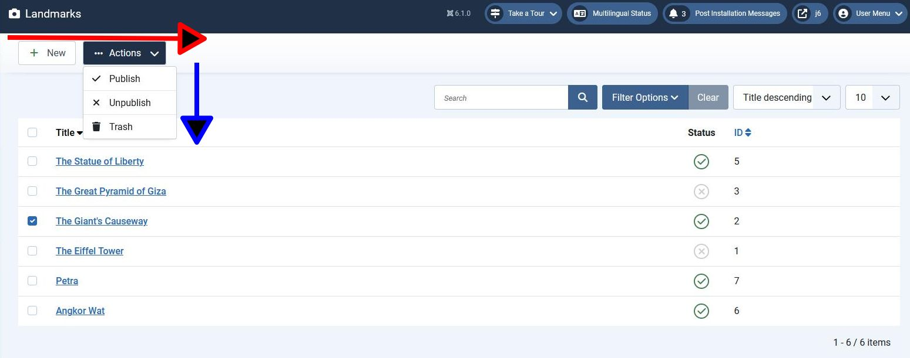

## Introduction

In this step we add a couple of features which demonstrate Joomla toolbars:

- we change the way landmark records are deleted to instead align with how articles are deleted in com_content, and,

- we expand the buttons on the landmark edit form to include the Save & New and Save as Copy functionality.

The code is available at [com_example step 13](https://github.com/joomla/manual-examples/tree/main/component-tutorial/step13_alternative_delete).

## Background

### Trash Bin

Joomla implements a 2-stage approach to deleting articles, using a trash / recycle bin:

1. The articles are given a published state of "Trashed" - implemented as int -2. 
From this they can be reinstated by change the state back to "Published" or "Unpublished".
The default Articles View displays articles with the state "published" or "unpublished", but doesn't display those with a "trashed" state. 

2. The trashed articles can be displayed in the Articles View by selecting Trashed within the published state filter field. 
A button to empty the trash (and permanently delete the articles) is then displayed.

In this step we implement this approach for the landmarks records. 

### Toolbars



Toolbars are objects onto which you can add buttons to perform actions.
In the screenshot there are 2 toolbars:

1. The main toolbar (highlighted with a red arrow) onto which we've put the New button and the Actions button.
As you add buttons onto this toolbar they're positioned horizontally along the direction of this red arrow.

2. A subsidiary toolbar (highlighted with a blue arrow) onto which we've put the Publish, Unpublish and Trash buttons.
Buttons on this toolbar are positioned vertically, along the direction of this blue arrow.
This toolbar is a child of the Actions button (implemented as a dropdown button). 

Both toolbars are instances of the same Joomla\CMS\Toolbar\Toolbar object;
it's just the CSS styling which makes them appear different.

You don't render the toolbars in your tmpl file, but rather Joomla renders them within the administrator mod_toolbar Module.

To get a handle on the main Toolbar use within the View class:

```php
$toolbar  = $this->getDocument()->getToolbar();
```

If the Toolbar instance doesn't exist, then the getToolbar call will create it.

We can then add buttons to the toolbars, using the [Toolbar API methods](cms-api://classes/Joomla-CMS-Toolbar-Toolbar.html), eg:

```php
$newButton = $toolbar->addNew('landmark.add', 'JTOOLBAR_NEW');   // add a New button
```

Alternatively you can add buttons using the ToolbarHelper class, eg:

```php
use Joomla\CMS\Toolbar\ToolbarHelper;
...
ToolbarHelper::addNew('landmark.add', 'JTOOLBAR_NEW');   // New button
```

The ToolbarHelper methods will obtain the Toolbar instance from `$this->getDocument()->getToolbar()`.

When the mod_toolbar module runs it will call getToolbar on the Document object,
and will then render the toolbars and associated buttons which your extension has defined.

### Dropdown Button and Child Toolbars

To create the second toolbar you need first to create a dropdown button (giving it any name you choose),
and then create the child toolbar from it:

```php
$dropdown = $toolbar->dropdownButton('save-group');
$childBar = $dropdown->getChildToolbar();
```

You can then add buttons to the child toolbar in the same way as for the main toolbar, eg:

```php
$publishButton = $childBar->publish('landmarks.publish');
```

### Button Properties

You can set options of the button by calling functions listed at, for example, [Standard Button methods](cms-api://classes/Joomla-CMS-Toolbar-Button-StandardButton.html).

The key options to set are:

- text - what is displayed on the button

- task - what the task parameter is set to within the submitted form when this button is pressed

- listCheck - if true, then the button is made active only when at least one record is selected

- icon - the icon displayed on the button

(Some of these can be set in the method call to create the button).

For the dropdown button there is another method: `toggleSplit(value)`:

- if `value` is true (which is the default) then the dropdown button shows a button which performs an action,
and the caret icon which toggles the opening and closing of the dropdown toolbar is separate from the action button part. 
For example, on the article edit form the dropdown button has two parts:

  - the action Save & Close - pressing this button causes the form to be submitted with `task` set to 'article.save'
  
  - the icon which toggles the opening and closing of the dropdown child toolbar

- if `value` is false then the dropdown button just shows text, and pressing it just toggles the display of the dropdown toolbar.
For example, on the Articles form pressing the '... Actions' button just shows/hides the child toolbar.

## Code Changes - Landmarks Form

The Landmarks View class has the updated addToolBar function:

```php title="administrator/components/com_example/src/View/Landmarks/HtmlView.php::addToolBar"
    private function addToolBar() 
    {
        ToolBarHelper::title(Text::_('COM_EXAMPLE_LANDMARKS_VIEW_TITLE'), 'camera');
        ToolbarHelper::addNew('landmark.add', 'JTOOLBAR_NEW');   // New button
      // highlight-start
        $toolbar  = $this->getDocument()->getToolbar();
        $dropdown = $toolbar->dropdownButton('status-group')
            ->text('JTOOLBAR_CHANGE_STATUS')
            ->toggleSplit(false)
            ->icon('icon-ellipsis-h')
            ->buttonClass('btn btn-action')
            ->listCheck(true);
        $childBar = $dropdown->getChildToolbar();
        $childBar->publish('landmarks.publish')->listCheck(true);
        $childBar->unpublish('landmarks.unpublish')->listCheck(true);

        if ($this->state->get('filter.published') != -2) {  // add a "move to trash" button to child toolbar
            $childBar->trash('landmarks.trash')->listCheck(true);
        }
        if ($this->state->get('filter.published') == -2) {  // add an "empty trash" button to main toolbar
            $toolbar->delete('landmarks.delete', 'JTOOLBAR_DELETE_FROM_TRASH')
                ->message('JGLOBAL_CONFIRM_DELETE')
                ->icon('fa fa-circle-xmark')
                ->listCheck(true);
        }
      // highlight-end
    }
```

Here we've moved the Publish and Unpublish buttons into the child toolbar,
and coded logic to decide whether to display the "move to trash" or "empty trash" buttons. 

In the LandmarksModel there is more complex logic to create the WHERE clause related to filtering by published state:

```php title="administrator/components/com_example/src/Model/LandmarksModel.php"
    protected function getListQuery()
    {
        ...
        
        // Filtering - by published state
        $published = (string) $this->getState('filter.published');
      // highlight-start
        if ($published !== '*') {  // if All is selected, then we don't add a WHERE clause, otherwise ...
            if (is_numeric($published)) {  // if a single publish state is selected, then add WHERE clause for that state
                $state = (int) $published;
                $query->where($db->quoteName('published') . ' = :state')
                    ->bind(':state', $state, ParameterType::INTEGER);
            } else {  // if no particular state is selected, then add WHERE clause to include Published and Unpublished states
                $query->whereIn($db->quoteName('published'), [0,1]);
            }
        }
      // highlight-end

        ...
    }
```

## Code Changes - Landmark Edit Form

In the Landmark View class addToolBar function we change the Save & Close button to be a dropdown with the 2 additional options:

```php title="administrator/components/com_example/src/View/Landmark/HtmlView.php::addToolBar"
    private function addToolBar() {

        // Hide Joomla Administrator Main menu
        Factory::getApplication()->getInput()->set('hidemainmenu', true);

        ToolBarHelper::title(Text::_('COM_EXAMPLE_LANDMARK_EDIT'));
        ToolbarHelper::apply('landmark.apply', 'JTOOLBAR_APPLY');   // Save button
      // highlight-start
        $toolbar  = $this->getDocument()->getToolbar();
        $dropdown = $toolbar->dropdownButton('save-group');
        $childBar = $dropdown->getChildToolbar();
        $childBar->save('landmark.save');           // Save & Close button
        $childBar->save2new('landmark.save2new');   // Save & New button
        $childBar->save2copy('landmark.save2copy'); // Save as Copy button
      // highlight-end
        ToolbarHelper::cancel('landmark.cancel', 'JTOOLBAR_CLOSE'); // Cancel button
    }
```

We don't need to do anything further to get the Save & New and Save as Copy functionality to work, Joomla handles it all for us!

## Updated Form definitions

We have to allow a published status of -2 (trashed) in both the landmark edit form and the landmarks filter form.

```xml title="administrator/components/com_example/forms/landmark.xml"
<?xml version="1.0" encoding="utf-8"?>
<form> 
    <field
            name="id"
            type="text"
            label="JGLOBAL_FIELD_ID_LABEL"
            class="readonly"
            default="0"
            readonly="true"
            />
    <field
            name="title"
            type="text"
            label="COM_EXAMPLE_LANDMARK_TITLE_LABEL"
            description="COM_EXAMPLE_LANDMARK_TITLE_DESC"
            required="true"
            default=""
            />
    <field  name="description" 
            type="editor"
            label="COM_EXAMPLE_LANDMARK_DESCRIPTION_LABEL" 
            description="COM_EXAMPLE_LANDMARK_DESCRIPTION_DESC"
            filter="\Joomla\CMS\Component\ComponentHelper::filterText" 
            buttons="true" 
            />
    <field
            name="published"
            type="list"
            label="JSTATUS"
            default="1"
            validate="options"
            >
            <option value="1">JPUBLISHED</option>
            <option value="0">JUNPUBLISHED</option>
          <!-- highlight-next-line -->
            <option value="-2">JTRASHED</option>
    </field>
</form>
```

```xml title="administrator/components/com_example/forms/filter_landmarks.xml"
<?xml version="1.0" encoding="UTF-8"?>
<form>
    <fields name="filter">
        <field
            name="search"
            type="text"
            inputmode="search"
            label="COM_EXAMPLE_FILTER_SEARCH_LABEL"
            description="COM_EXAMPLE_FILTER_SEARCH_DESC"
            hint="JSEARCH_FILTER"
        />
        <field
            name="published"
            type="status"
            label="JOPTION_SELECT_PUBLISHED"
            class="js-select-submit-on-change"
            extension="com_example"
          <!-- highlight-next-line -->
            optionsFilter="*,0,1,-2"
            >
            <option value="">JOPTION_SELECT_PUBLISHED</option>
        </field>
    </fields>
    <fields name="list">
        <field
            name="fullordering"
            type="list"
            label="JGLOBAL_SORT_BY"
            class="js-select-submit-on-change"
            default="id ASC"
            validate="options"
            >
            <option value="">JGLOBAL_SORT_BY</option>
            <option value="title ASC">JGLOBAL_TITLE_ASC</option>
            <option value="title DESC">JGLOBAL_TITLE_DESC</option>
            <option value="id ASC">JGRID_HEADING_ID_ASC</option>
            <option value="id DESC">JGRID_HEADING_ID_DESC</option>
        </field>
        <field
            name="limit"
            type="limitbox"
            label="JGLOBAL_LIST_LIMIT"
            default="5"
            class="js-select-submit-on-change"
        />
    </fields>
</form>
```

## Updated Language Strings

```php title="administrator/components/com_example/language/en-GB/com_example.ini"
COM_EXAMPLE_LANDMARK_FIELD_SELECT_TITLE="Landmark"
COM_EXAMPLE_LANDMARK_FIELD_SELECT_DESC="Select a landmark"
; Admin landmarks view
COM_EXAMPLE_LANDMARKS_VIEW_TITLE="Landmarks"
COM_EXAMPLE_LANDMARKS_CAPTION="Table of Landmarks"
COM_EXAMPLE_LANDMARK_TITLE_LABEL="Name"
; Admin landmarks view - confirmations
COM_EXAMPLE_N_ITEMS_DELETED_1="Landmark deleted."
COM_EXAMPLE_N_ITEMS_DELETED="%d Landmarks deleted."
COM_EXAMPLE_N_ITEMS_PUBLISHED_1="Landmark published."
COM_EXAMPLE_N_ITEMS_PUBLISHED="%d Landmarks published."
COM_EXAMPLE_N_ITEMS_UNPUBLISHED_1="Landmark unpublished."
COM_EXAMPLE_N_ITEMS_UNPUBLISHED="%d Landmarks unpublished."
// highlight-start
COM_EXAMPLE_N_ITEMS_TRASHED_1="Landmark moved to trash."
COM_EXAMPLE_N_ITEMS_TRASHED="%d Landmarks moved to trash."
// highlight-end
; Admin landmark edit form
COM_EXAMPLE_LANDMARK_EDIT="Landmarks: Edit"
COM_EXAMPLE_LANDMARK_TITLE_DESC="Name of the landmark"
COM_EXAMPLE_LANDMARK_DESCRIPTION_LABEL="Description"
COM_EXAMPLE_LANDMARK_DESCRIPTION_DESC="A summary description of the landmark"
COM_EXAMPLE_SAVE_SUCCESS="Landmark successfully saved"
```

## Installation

In the manifest file, update the version number:

```xml title="com_example/example.xml"
  <!-- highlight-next-line -->
    <version>0.13.0</version>
...
```

and then install the updated component. 

## Exploring your installation

Confirm that the new functionality works as expected:

- the 2-step deletion of records

- the Save & New and Save as Copy functionality.

Also notice the difference between the dropdown buttons in the 2 forms:

- filter form - the dropdown button has `toggleSplit` set to false

- landmark edit form - the dropdown button has `toggleSplit` set to true

## Challenge

In the View class files we previously used ToolbarHelper functions to create the buttons.
In this step some of those buttons have been created using calls such as:

```php
$toolbar->delete('landmarks.delete', 'JTOOLBAR_DELETE_FROM_TRASH')
```

Can you change the remaining ToolbarHelper functions which create buttons to use the `$toolbar` methods instead?

## Footnote

Joomla has a curious feature in that if a dropdown button using toggleSplit doesn't have another button to its right,
then the caret of the dropdown button is shown on the left rather than on the right. I don't know why this is so!